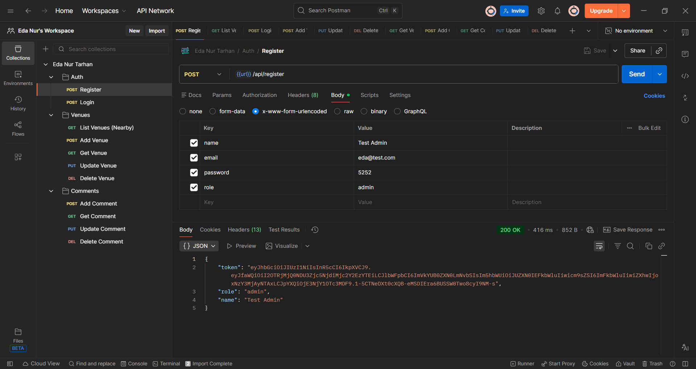
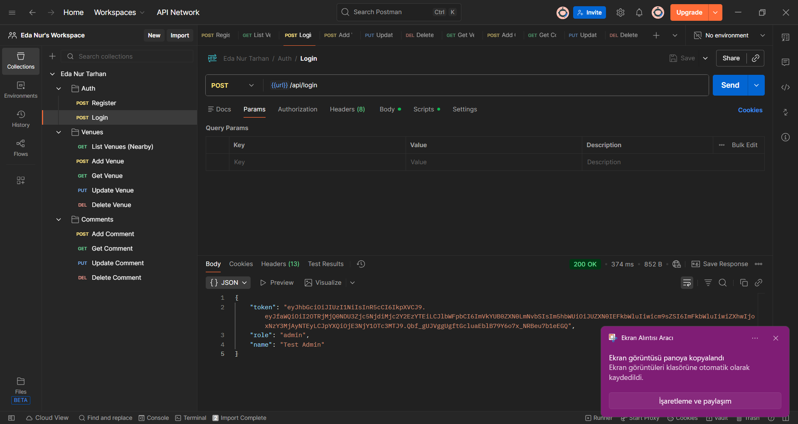
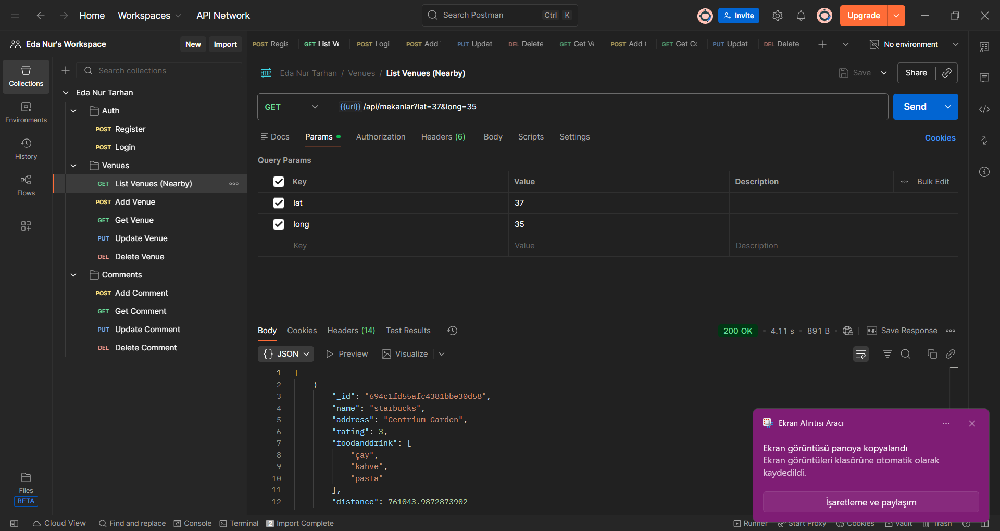
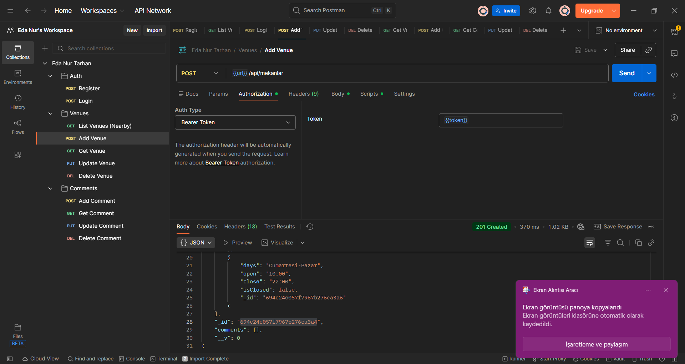
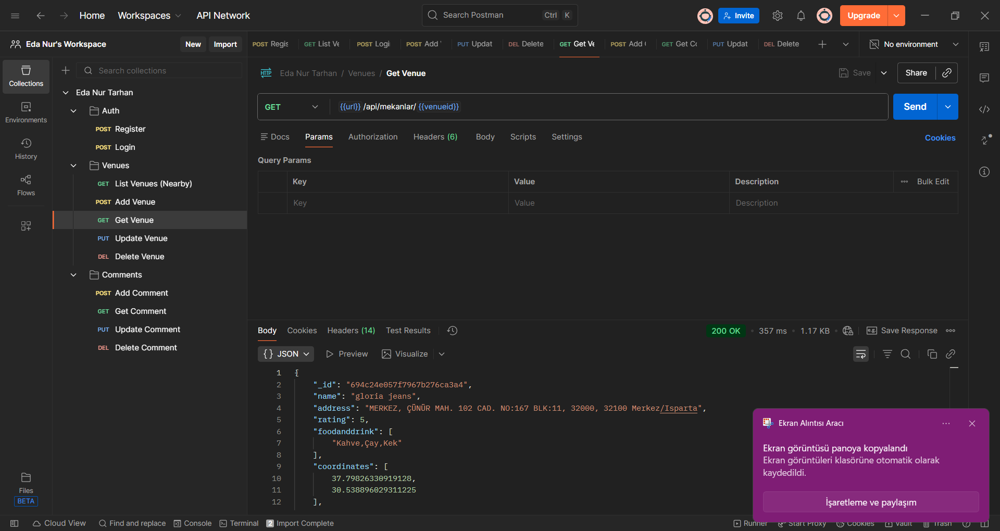
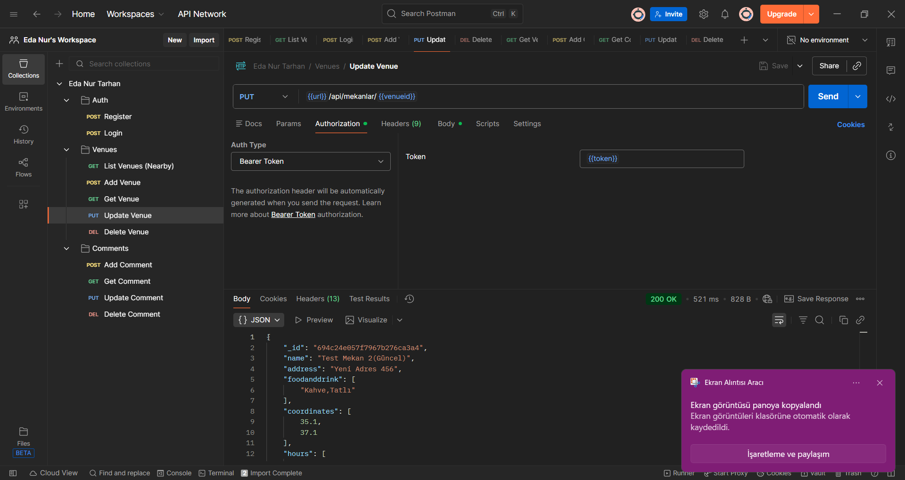
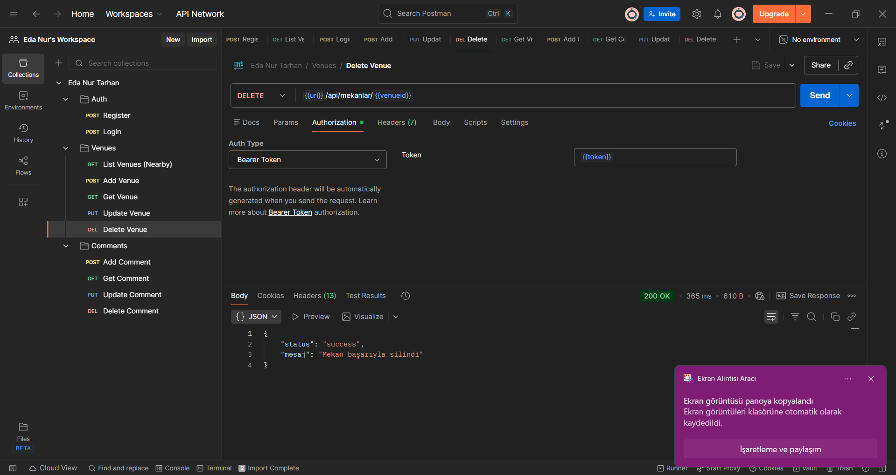
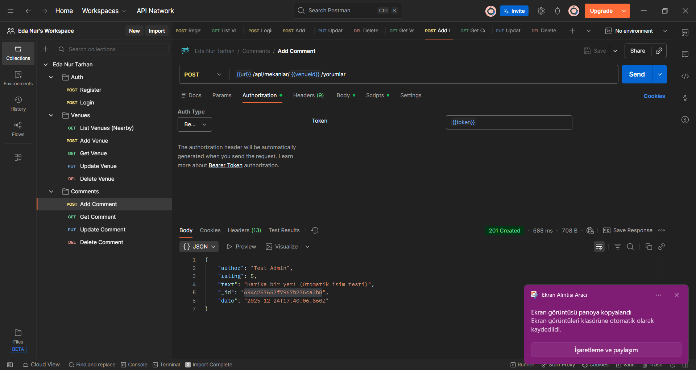
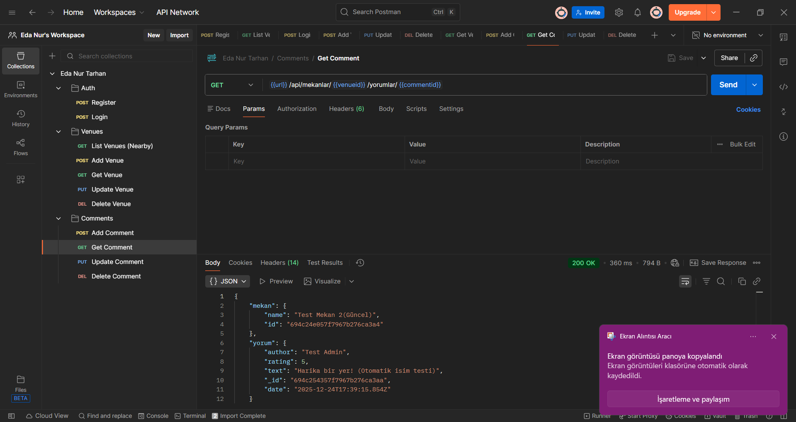
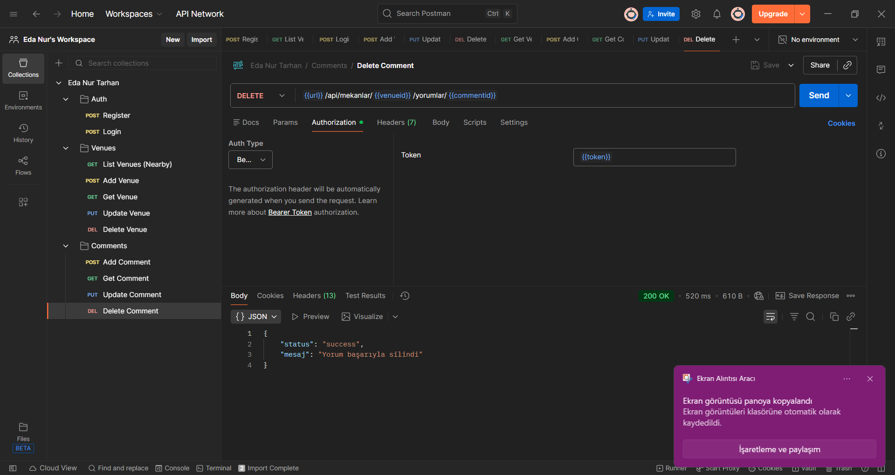

# MEKANBUL FULL STACK PROJESİ

Bu proje, Web Teknolojileri ve Programlama dersi kapsamında geliştirilen, **Backend** ve **Frontend** mimarisini içeren kapsamlı bir mekan rehberi uygulamasıdır.

🔗 **Canlı Demo:** [mekanlar.vercel.app](https://mekanbul-wct2.vercel.app/)

🔗**Backend Adresi:**[mekanlar.vercel.app](https://mekanbul-liard.vercel.app/)

## 🚀 Proje Hakkında ve Özellikler

Bu uygulama, standart CRUD işlemlerinin ötesinde, güvenlik ve rol tabanlı yönetim özellikleri içerir. Ödev gereksinimlerine uygun olarak aşağıdaki yeteneklere sahiptir:

* **Kimlik Doğrulama (JWT):** JSON Web Token altyapısı ile güvenli giriş ve kayıt sistemi.
* **Rol Yönetimi (User & Admin):** Sistemde "User" ve "Admin" olmak üzere iki farklı rol bulunur.
* **Yönetici Paneli (Admin Dashboard):**
    * Sadece `admin` yetkisine sahip kullanıcılar erişebilir.
    * Mekan ekleme, silme ve güncelleme işlemleri buradan yönetilir.
    * Konumdan bağımsız tüm mekanlar listelenir.
* **Güvenlik ve Korumalı Rotalar:** Admin sayfalarına yetkisiz erişim engellenmiştir.
* **Oturum Güvenliği:** Admin panelinde 10 saniye hareketsizlik durumunda otomatik çıkış yapılır.
* **Yorum Sistemi:** Sadece giriş yapmış kayıtlı kullanıcılar mekanlara yorum yapabilir.

##  Teknolojiler

* **Backend:** Node.js, Express.js
* **Veritabanı:** MongoDB (Mongoose)
* **Frontend:** HTML5, CSS, JavaScript 
* **Auth:** JWT (JSON Web Token)

## 📂 Kurulum

Projeyi yerel ortamınızda çalıştırmak için:

1.  Repoyu klonlayın: `git clone https://github.com/tarhaneda/mekanbul.git`
2.  Ana dizinde gerekli paketleri yükleyin: `npm install`
3.  Uygulamayı başlatın: `npm start`

---

## 📸 API Testleri ve Ekran Görüntüleri

Projenin backend fonksiyonlarının (Auth, Venue, Comment) çalıştığını gösteren test sonuçları aşağıdadır.

### 1. Kimlik Doğrulama (Authentication)
Kullanıcı kayıt ve giriş işlemleri (JWT token döner).

| Register (Kayıt) | Login (Giriş) |
| :---: | :---: |
|  |  |

### 2. Mekan Yönetimi (Venue CRUD)
Mekanların listelenmesi, detaylarının çekilmesi ve Admin yetkisiyle yönetilmesi.

| Mekanları Listele | Mekan Ekle (Admin) |
| :---: | :---: |
|  |  |

| Mekan Detayı | Mekan Güncelle | Mekan Sil |
| :---: | :---: | :---: |
|  |  |  |

### 3. Yorum İşlemleri (Comments)
Kullanıcıların mekanlara yorum yapması ve yönetmesi.

| Yorum Ekle | Yorum Güncelle |
| :---: | :---: |
|  |  |

| Yorum Getir | Yorum Sil |
| :---: | :---: |
|  |  |

---

###  API Uç Noktaları (Özet)

* `GET /api/venues` - Mekanları listeler (Konum bazlı)
* `POST /api/venues` - Yeni mekan ekler (Admin Token gerekir)
* `GET /api/venues/:id` - Mekan detayını getirir
* `PUT /api/venues/:id` - Mekanı günceller (Admin Token gerekir)
* `DELETE /api/venues/:id` - Mekanı siler (Admin Token gerekir)
* `POST /api/register` - Yeni kullanıcı kaydı
* `POST /api/login` - Kullanıcı girişi

---
Bu proje **Eda Nur TARHAN** tarafından hazırlanmıştır.